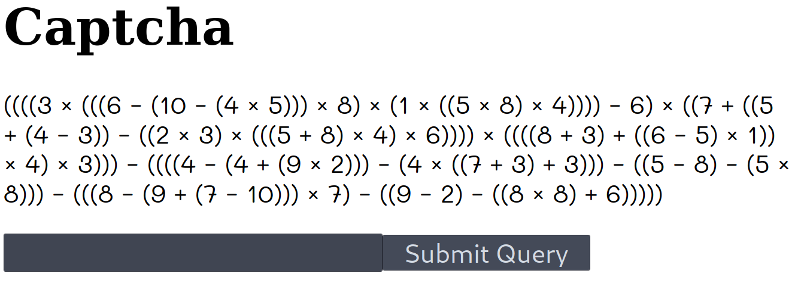

# C8: captcha

Task prompt:
```
Charvises (the native species which lived on Charvis 8HD before the first settlers arrived) were very good at math. In a 
surprising symbiosis relationship between humans and Charvises, it was agreed that the Charvises would be responsible for C8.

Can you pass their CAPTCHA (Completely Automated Public Turing Test to tell Charvises and Humans Apart)?
```

The challenge involved completing a complicated CAPTCHA, however, you only have 5 seconds to complete it to receive the flag.

Captcha example:


### Attempt 1
Initially I thought I could complete the challenge using some OCR (Ocular Character Recognition).

The code below shows the attempt:
```python
import numexpr as nx
import pytesseract
import cv2
import sys

if len(sys.argv) == 2:
    img_path = sys.argv[1]
else:
    print("[*] Usage: python OCR_Attempt IMAGE_PATH")
    exit()

# Read image from disk
im = cv2.imread(img_path, cv2.IMREAD_REDUCED_GRAYSCALE_2)
scale_percentage = 100

# Resizing
width = int(im.shape[1] * scale_percentage / 100)
height = int(im.shape[0] * scale_percentage / 100)
dim = (width, height)
im_resize = cv2.resize(im, dim, interpolation=cv2.INTER_AREA)

# Run tesseract OCR on image
text = pytesseract.image_to_string(image=im_resize, lang="eng")

print(text)
```

Output:
```
((((8 x (((6 - (10 = (4 x 3))) x 8) x (1x ((S x8) x4) -6)x((#+((S
+ (4-38) - (2x8) x (((5+8) x4) x6)))) x ((((& +3) +((6-35)x1))
x 4) x3) -((((4-(4+(9x2)-(Ex({(F+3)+3)-((5-8)-(5~
8)) -(((8-(O+(F-10))) x3) -(9-2)-((&x8)+86))))
```

As you can see the output really was not bad. However, it was not accurate enough to work. I tried with this method for a little longer but the strange font being used was not working with the english NN built into pytesseract. Training a custom NN could have worked but this would have been a time consuming operation.