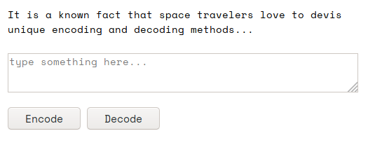

# C1 : dot-n-dash 

### Description
```
You are the last person on planet Charvis 8HD. Everyone has decided to leave because Charvis 9HD is the hipper place to live. 
As 
the last person to leave, your Captain sent you the following instructions:

"Make sure you enable the Charvis 8HD Defense System (CDS) after taking off in your spaceship."

However, you misread the instructions and activated the CDS before leaving the planet. You are now stuck on this planet. Can 
you figure out how to manually disable the 10 defense systems (C1 thru C10) which comprise CDS in order to safely take off?

Thankfully, Charvis 8HD does not have strong dust storms and you will not need to travel 2,000 miles in a rover.
C1: dot-n-dash

The instructions to disable C1 were considered restricted. As a result, they were stored only in encoded form.

The code to decode the instructions was regrettably lost due to cosmic radiation. However, the encoder survived.

Can you still decode the instructions to disable C1?

note: all the files we provide are compressed using jar. You should be able to decompress them on a command line (e.g. jar xf 
dot-n-dash.jar) or using a graphical decompression tool.

Your browser may warn you that "this type of file can harm your computer" because jar files typically contain Java code.
```

The challenge begins with a webpage containing encode and decode functionality for an unknown format.



For example the code for 'a' is:

```
-------.-.------.
```

The encoding functionality for the website is provided, but the decode was damaged by cosmic radiation. The task is to reverse the encoding.


### Encode

The first step of the encoding is found within this function:

```javascript
var a=[];
for (var i = 0; i < input.length; i++) {
    var t = input.charCodeAt(i);
    for (var j=0; j<8; j++) {
      if ((t >> j) & 1) {
        a.push(1 + j + (input.length - 1 - i) * 8);
      }
    }
}
```

This method has been lightly obfuscated. The method starts by looping around each individual character of the input. Then each character is converted into their numerical form

```javascript
var t = input.charCodeAt(i);
```

Then this numerical value is placed into a for loop with 8 iterations, this was found to be for the 8 bits in a single bytes used to represent a character.

The key element of this function is this line:

```javascript
if ((t >> j) & 1) {
```

With some debugging we found all it was doing was checking for the positions of 1's in a binary value. This is because when a shift results in a 1 dropping off the end the result is equal to one and therefore the condition ```1 & 1``` becomes true.

Then this value is placed into the ```a``` list.

This line:

```javascript
a.push(1 + j + (input.length - 1 - i) * 8);
```

Adds the values to the list in a seemly complex way. The reason behind this will become clear later.

The next stage of the encoding:

```javascript
var b = [];
  while (a.length) {
    var t = (Math.random() * a.length)|0;
    b.push(a[t]);
    a = a.slice(0, t).concat(a.slice(t+1));
  }
```

As it can be seen the use of ```Math.random()```. This was very confusing at this stage, because accurately reversing randomisation is not easily achievable. This will again, be clear later.

With the use of some more debugging we found that this functions purpose is to randomise the order of the array ```a```.


The final function translates this array into the ```-``` and ```.```.

```javascript
var r = '';
while (b.length) {
    var t = b.pop();
    r = r + "-".repeat(t) + ".";
}
return r;
```

### Decode

Now, lets reverse the entire process. Using the final function of the encode we know how to convert the dashs and dots into the ```b``` array.

A function like this will achieve that:

```javascript
var b = []
var dashCount = 0
for (var i = 0; i < input.length; i++)
{
    var char = input.charAt(i);      
    if (char != ".") {
        dashCount++;
    }
    else {
        b.push(dashCount);
        dashCount = 0;
    }
}
```

This provides us with the ```b``` before conversion. 

Now, moving onto the randomised order of ```b```. In the first function when adding to ```a``` the value was multiplied by decreasing values of 8. The line can be seen below:

```javascript
a.push(1 + j + (input.length - 1 - i) * 8);
```

This means the values are separable by a factor of eight. An example can be seen below:

The input ```ab``` produces one ```b``` ordering of:

```
6,9,7,14,2,15
```

If we were to sort this list:

```
2,6,7,9,14,15
```

The list can be separated into two values! Anything over a factor of 8 is separate values of ```a```

We start by sorting ```b```:


```javascript
b.sort(function(a, b){return a - b});
```

We can then use this to reverse the entire problem:

```javascript
var values = []
var bound = 8;
var temp = "00000000"
for (var x = 0; x < b.length; x++)
{
    if (b[x] > bound)
    {
        bound += 8
        values.push(flipAndConvertToAscii(temp))
        
        //Reset
        temp = "00000000"
    }
    
    pos = b[x] - (bound - 8) - 1;
    temp = setCharAt(temp, pos, "1")
    
}
values.push(flipAndConvertToAscii(temp))
values.reverse()
return values.join("")
```

The function:
```javascript
flipAndConvertToAscii()
```

Is needed due to the binary value originally being read right from left and our reversing method doing it the opposite way.

And the function:
```javascript
setCharAt()
```

Places a 1 in a specific position in the ```temp``` variable.

The entire code can be seen below:

```javascript
function setCharAt(str,index,chr) {
    if(index > str.length-1) return str;
    return str.substr(0,index) + chr + str.substr(index+1);
}
function flipAndConvertToAscii(str) {
    parts = str.split("")
    parts.reverse()
    binstr = parts.join("")
    return String.fromCharCode(parseInt(binstr,2).toString(10))
}

function _decode(input) {

    // Conversions from '-' and '.' to the b array
    var b = []
    var dashCount = 0
    for (var i = 0; i < input.length; i++)
    {
        var char = input.charAt(i);      
        if (char != ".") {
            dashCount++;
        }
        else {
            b.push(dashCount);
            dashCount = 0;
        }
    }

    //Randomisation reversing
    b.sort(function(a, b){return a - b});
    
    // Converting b to a
    values = []
    var bound = 8;
    var temp = "00000000"
    for (var x = 0; x < b.length; x++)
    {
        if (b[x] > bound)
        {
            bound += 8
            values.push(flipAndConvertToAscii(temp))
            //Reset
            temp = "00000000"
        }
       
        pos = b[x] - (bound - 8) - 1;
        temp = setCharAt(temp, pos, "1")
        
    }
    values.push(flipAndConvertToAscii(temp))
    values.reverse()
    return values.join("")
}
```

This can now be used to reverse the provided message!

This provides us with the message:

```
Congrats, you solved C1! The flag is flag-bd38908e375c643d03c6.
```

```
FLAG: flag-bd38908e375c643d03c6
```