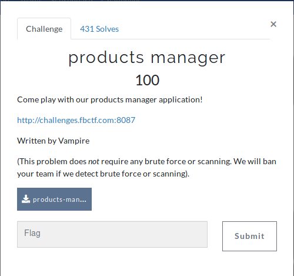
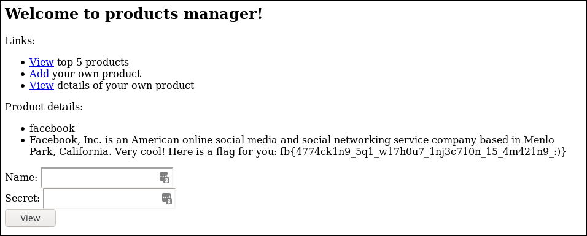

At the beginning of the challenge, we are provided with a simple web application.


Alongside this, we are provided with the source code of the application.

On inspection of the source code, it seems SQL Injection isn't an option due to correct preparation of the 
SQL statements. 

E.g.
```php
[...]
global $db;
  $statement = $db->prepare(
    "SELECT name, description FROM products WHERE name = ?"
  );
  check_errors($statement);
  $statement->bind_param("s", $name);
[...]
```

Reading in the source code there is a comment at the start that shows how we can get the flag: 

```php
/*
INSERT INTO products VALUES('facebook', sha256(....), 'FLAG_HERE');
INSERT INTO products VALUES('messenger', sha256(....), ....);
INSERT INTO products VALUES('instagram', sha256(....), ....);
INSERT INTO products VALUES('whatsapp', sha256(....), ....);
INSERT INTO products VALUES('oculus-rift', sha256(....), ....);
*/
```
We somehow need to reach the description value of the `facebook` element

# Exploit

The exploitable code is here:
```php
function handle_post() {
  global $_POST;

  $name = $_POST["name"];
  $secret = $_POST["secret"];

  if (isset($name) && $name !== ""
        && isset($secret) && $secret !== "") {
    if (check_name_secret($name, hash('sha256', $secret)) === false) {
      return "Incorrect name or secret, please try again";
    }

    $product = get_product($name);

    echo "<p>Product details:";
    echo "<ul><li>" . htmlentities($product['name']) . "</li>";
    echo "<li>" . htmlentities($product['description']) . "</li></ul></p>";
  }

  return null;
}
```

The `check_name_secret` checks that a product exists with the entered `name` and `secret` combo. 

However, the `get_product` function only returns an element from the database by using the `name` parameter! 
This means we can add another element called `facebook` with a `secret` we know and get the program to return the first product found with the name `facebook` i.e. the one with the flag!

However, trying to do this we get this error:

```
Error: Product name already exists, please enter again
```

Let's try adding a space?

This gives us:

```
Product has been added
```

Then using the details we submitted, when we view the `facebook` product the flag is returned!



This is an issue with MySQL. Taking a [quote](https://dev.mysql.com/doc/refman/5.7/en/char.html) from the documentation:

```
All MySQL collations are of type PADSPACE. 
This means that all CHAR, VARCHAR, and TEXT 
values in MySQL are compared without regard 
to any trailing spaces. 
```

This results in the MySQL statement treating `"facebook "` the same as `"facebook"` etc.

FLAG:
```
fb{4774ck1n9_5q1_w17h0u7_1nj3c710n_15_4m421n9_:)}
```
