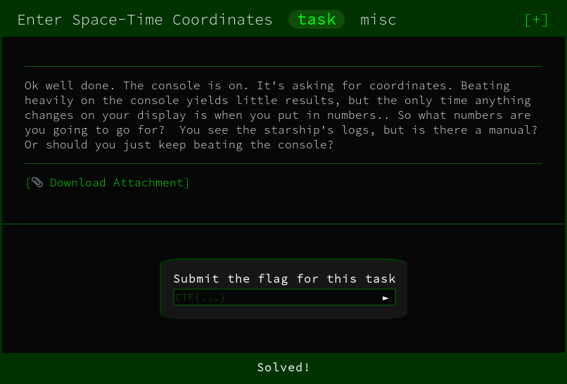

We're initally provided with a binary with the output:

```
Travel coordinator
0: AC+79 3888 - 55103306031561, 216201472799928
1: Pliamas Sos - 117145678638203, 50486337082353
2: Ophiuchus - 15727012071737, 71740065771621
3: Pax Memor -ne4456 Hi Pro - 214688618709411, 26513518243538
4: Camion Gyrin - 37072631554325, 150823598069560
5: CTF - <REDACTED>

Enter your destination's x coordinate:
>>> 
```

Each time the binary is executed the coordinates change. 

Running the simple command of `strings` on the binary will reveal all character strings baked into the binary

Filtering through the output we can see the flag in plain text. Nice litte quick introduction to the CTF

```
[..]
Arrived at the flag. Congrats, your flag is: CTF{welcome_to_googlectf}
[..]
```

FLAG
```
CTF{welcome_to_googlectf}
```