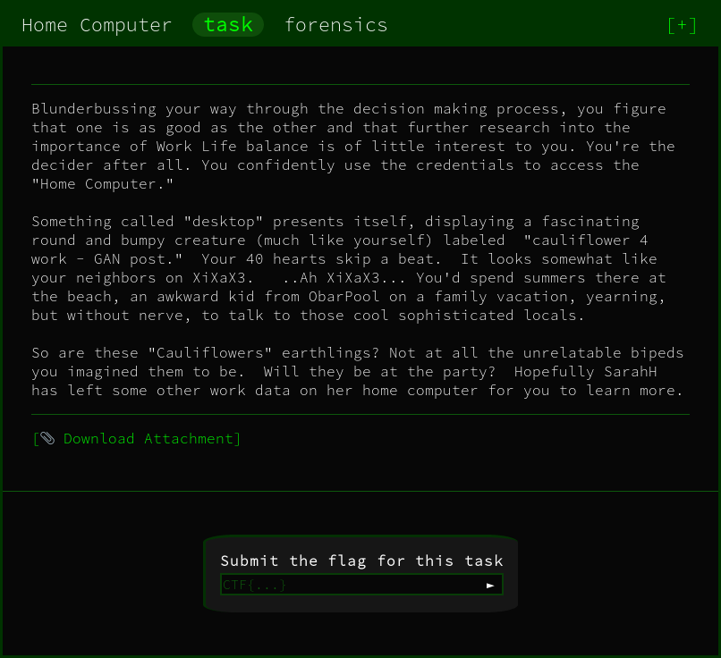

We're initially provided with a `.ntfs` volume called `family.ntfs`.

Mounting the volume can be achived like so:

```
sudo mount family.ntfs /mnt
```
This will position the file at the `/mnt` file path and gives us the ability to explore the filesystem.

On initial inspection the operating system present on the drive is Windows based. Alongside this, lots of the files on the system are empty. This explains the tiny `25mb` size.

In the `/Users/Family/Documents` path is a text file containing:

```
I keep pictures of my credentials in extended attributes.
```

With my experience I know this is a well known technique for 'hiding' information is a special type of file metadata. This is called the [Extended Attributes](https://en.wikipedia.org/wiki/Extended_file_attributes).

Any hidden attributes can be detected using the tool `getfattr`. Running it on the `credentials.txt` reveals a hidden attribute

```
# file: credentials.txt
user.FILE0
```

Reading through the man page of the `getfattr` tool gives the the command line option:

```
    --only-values
           Dump out the raw extended attribute value(s) without encoding them.
```

This therefore, lets us retrieve the data.

Pipping it into a file like so:

```
getfattr --only-values credentials.txt > flag.png
```

Gives us the image:


FLAG:
```
CTF{congratsyoufoundmycreds}
```