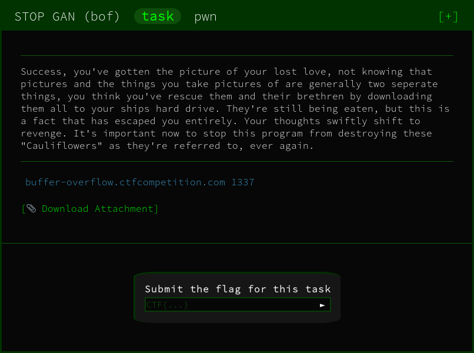

In this `pwn` challenge we're provided with a binary and it's source code

Running `checksec` on it we can see there is almost zero protection

```
RELRO           STACK CANARY      NX            PIE             
No RELRO        No canary found   NX disabled   No PIE
```

This means we have room to move for our attack.

With further inspection into the code, it is clear that we won't be able to overflow a buffer using a `gets` or misconfigured `fgets` as the code has the buffers covered.

However, there is a `printf` command that returns our input:

```c
printf("Inputs: %s", inputs);
```

This is susceptible to a `Format String Attack`. The crash can therefore be triggered by the entering of lots of `%s` values. 
Every time `printf` outputs a `%s` value it will fetch a number off the stack, and will print its value to the screen. 

Therefore, the more values entered and thus, printed will give us a better chance of accessing memory we're not allowed to. 
This invalid access of memory will give us our desired `Segmentation Fault`.

Entering a large number of `%s` values will crash the system and return our flag.


FLAG
```
CTF{Why_does_cauliflower_threaten_us}
```