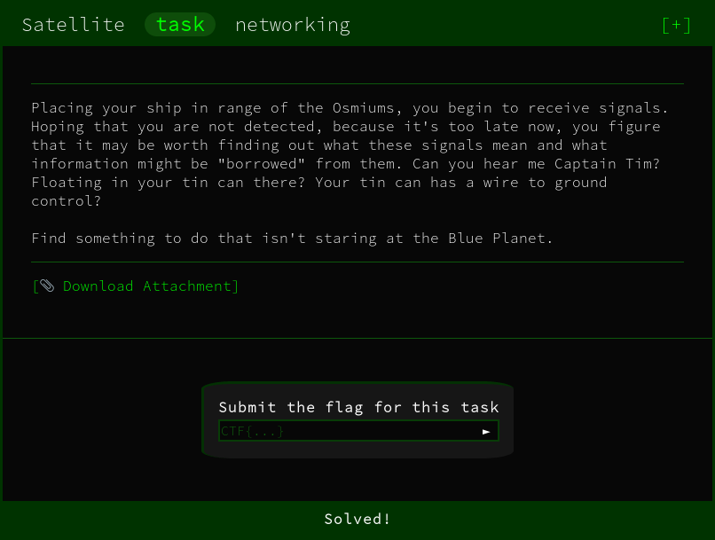
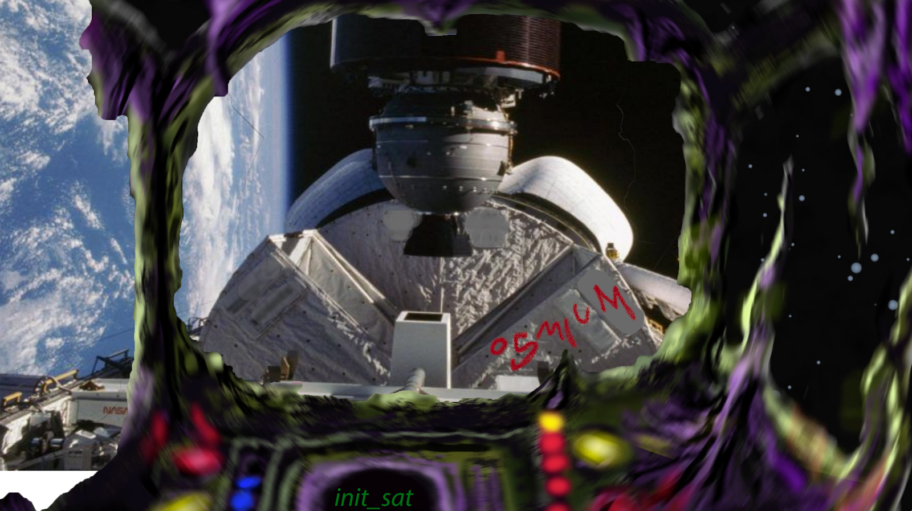

The challenge initally provides us with a binary `init_sat` that provides this output:

```
Hello Operator. Ready to connect to a satellite?
Enter the name of the satellite to connect to or 'exit' to quit
>>>
```

Using the `README.pdf` document provided we can get the name to enter `osmium` as it is written on the picture of the satellite.



That gives us a link to a GDoc with a `base64` string:
```
VXNlcm5hbWU6IHdpcmVzaGFyay1yb2NrcwpQYXNzd29yZDogc3RhcnQtc25pZmZpbmchCg==
```

This gives us some credentials:
```
Username: wireshark-rocks
Password: start-sniffing!
```

This is effectively a hint to capture traffic using `Wireshark`.

Using `strace` we can see that connections are occurring with the binary

```
strace -f -e trace=network ./init_sat 
```

```
[..]
[pid 11528] getpeername(3, {sa_family=AF_INET, sin_port=htons(1337), sin_addr=inet_addr("34.76.101.29")}, [112->16]) = 0
[..]
```

We get some connections over TCP to the ip address `34.76.101.29`

We'll use this in the filter for `Wireshark` to reduce the results

Using the filter we can see the `TCP Handshake` occuring between our client and the server


On further inspection of the packets we can see the `username` and `password` has been transfered in plain text! 

The communication between this address is visible and we can see the flag

```
[..]
0040   4c 26 86 d1 55 73 65 72 6e 61 6d 65 3a 20 62 72   L&..Username: br
0050   65 77 74 6f 6f 74 20 70 61 73 73 77 6f 72 64 3a   ewtoot password:
0060   20 43 54 46 7b 34 65 66 63 63 37 32 30 39 30 61    CTF{4efcc72090a
0070   66 32 38 66 64 33 33 61 32 31 31 38 39 38 35 35   f28fd33a21189855
0080   34 31 66 39 32 65 37 39 33 34 37 37 66 7d 09 31   41f92e793477f}.1
[..]
```

FLAG:
```
CTF{4efcc72090af28fd33a2118985541f92e793477f}
```