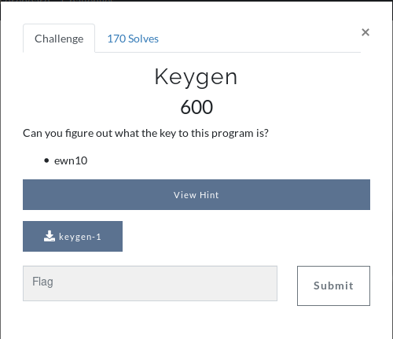
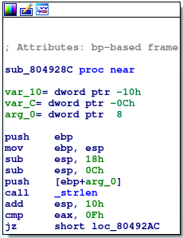
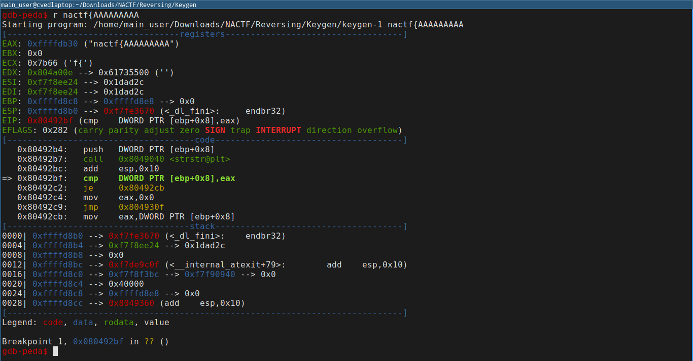

We're initially provided with a binary that checks an entered key.

```
$ ./keygen-1 KEY
Invalid key.
```

Running file on the command shows we're working with a 32-bit stripped binary.
```
keygen-1: ELF 32-bit LSB executable, Intel 80386, version 1 (SYSV), dynamically linked, interpreter /lib/ld-linux.so.2, BuildID[sha1]=daec6de6c97b83298ffd793d81d5a17426330985, for GNU/Linux 3.2.0, stripped
```

## Initial checks

I started by analyzing the binary using `ltrace`. This tool displays any external calls the binary makes.

```
$ ltrace ./keygen-1 KEY

__libc_start_main(0x8049311, 2, 0xffc00894, 0x80493a0 <unfinished ...>
strlen("KEY")                                                             = 3
puts("Invalid key.\n"Invalid key.

)                                                    = 14
+++ exited (status 0) +++
```

As it can be seen the program runs `strlen` on the entered key value. This suggests that the binary is looking for a specific length.

When looking at the disassembled code in `ida64` at the first call to `strlen`



It can be seen after the `str` the instruction: `cmp     eax, 0Fh` will compare the result of the `strlen` call to 15.

Running `ltrace` again with a 15 character input shows us:

```
$ ltrace ./keygen-1 AAAAAAAAAAAAAAA

__libc_start_main(0x8049311, 2, 0xfffceb64, 0x80493a0 <unfinished ...>
strlen("AAAAAAAAAAAAAAA")                                                          = 15
strstr("AAAAAAAAAAAAAAA", "nactf{")                                                = nil
puts("Invalid key.\n"Invalid key.

)                                                             = 14
+++ exited (status 0) +++
```

The program has now moved on pass the `strlen` call. The next call is to `strstr`. This command locates the position of a substring.

The `strstr` commands use was only apparent to me once I ran it dynamically through `gdb`.


The screenshot below shows the comparison of the output of `strstr` (in `EAX`) to the key passed as an argument (`ebp+0x8`).


As the comparison is checking for equality between the substring and the original string, no change should occur. The only way this would be possible is if the string started with `nactf{`. Therefore, the program is checking if the entered string starts with the target string.

The final format check is a check for a "}" at the end of the string.

This is achieved by the assembly:

```
   0x80492cb:	mov    eax,DWORD PTR [ebp+0x8]
   0x80492ce:	add    eax,0xe
   0x80492d1:	movzx  eax,BYTE PTR [eax]
   0x80492d4:	cmp    al,0x7d
```

The key string is loading with the first instruction (`ebp+0x8` is the location of the string). This pointer is then moved along 14 bytes and the value is reloaded as a single byte via the `movzx` command, this effectively zero-extends the byte to fit into the 32-bit register. The final byte is then compared to 0x7d ("}" in ascii).

## Main functionality

Now with the initial checks out of the way we can get into the main functionality of this binary.

The program then begins to loop around each individual character within the brackets.

This is a good time to look, at `ghidra`'s decompilation of the assembly:

```C
void FUN_080491b6(char *param_1)
{
  ulonglong uVar1;
  uint uVar2;
  bool bVar3;
  char *local_10;
  uint local_c;
  int local_8;
  
  local_c = 0;
  local_8 = 0;
  local_10 = param_1;
  while (local_10 < param_1 + 8) {
    uVar1 = (ulonglong)local_c;
    local_c = (uint)(uVar1 * 0x3e);
    local_8 = local_8 * 0x3e + (int)(uVar1 * 0x3e >> 0x20);
    if (('@' < *local_10) && (*local_10 < '[')) {
      uVar2 = (int)*local_10 - 0x41;
      bVar3 = CARRY4(local_c,uVar2);
      local_c = local_c + uVar2;
      local_8 = local_8 + ((int)uVar2 >> 0x1f) + (uint)bVar3;
    }
    if (('`' < *local_10) && (*local_10 < '{')) {
      uVar2 = (int)*local_10 - 0x47;
      bVar3 = CARRY4(local_c,uVar2);
      local_c = local_c + uVar2;
      local_8 = local_8 + ((int)uVar2 >> 0x1f) + (uint)bVar3;
    }
    if (('/' < *local_10) && (*local_10 < ':')) {
      uVar2 = (int)*local_10 + 4;
      bVar3 = CARRY4(local_c,uVar2);
      local_c = local_c + uVar2;
      local_8 = local_8 + ((int)uVar2 >> 0x1f) + (uint)bVar3;
    }
    local_10 = local_10 + 1;
  }
  return CONCAT44(local_8,local_c);
}
```

If we ignore some of the mess, we can see that the function is looking for characters in three different ranges:

```
   Uppercase: "@" -> "["
   Lowercase: "`" -> "{"
   Numbers:   "/" -> ":"
```

Now, working out what was happening with `local_c` and `local_8` took a while, I tried running it through a few times dynamically with `gdb` where I saw that the output to this function was being returned via `eax` and `ebx`.

This was confusing up until I noticed the `CDQ` command present at address `0804921c`. This command doubles the size of the value present in `eax` and places the overflow in `ebx`! This, therefore, means this program is returning a single large value.

With a little trial and error I was able to convert the `ghidra` attempt into actually functioning code:

```python
flag = "BBBBBBBB"

count = 0
for s in flag:
   
   count = count * 0x3e

   # Uppercase
   if '@' < s and s < '[':
      count += ord(s) - 0x41

   # Lowercase
   if '`' < s and s < '{':
      count += ord(s) - 0x47

   # Numbers
   if '/' < s and s < ':':
      count += ord(s) + 4

print(hex(count))
```

The code is quite simple in retrospect as it adds different values per character type.

With a little more searching I was able to find the target value for this function.

Using the information we gathered earlier about the value being split across `eax` and `ebx` we can see that the assembly below is checking for equality via and XOR.

```
   0x080492fd xor        EAX,0xfcaacf98
   0x08049302 xor        EDX,0x1371
   0x08049308 or         EAX,EDX
   0x0804930a test       EAX,EAX
```

Placing these values together we have the target value: `0x1371fcaacf98`

We, therefore, need to work this value backwards to obtain the flag. This can be achieved by trialing different characters and checking for exact division of the `0x3e`.

The script below allows us to reverse the target value and determine the characters:
```python
import subprocess
import random
import string
import os 

possibility = string.ascii_lowercase + \
              string.ascii_uppercase + \
              "1234567890"

TARGET_VALUE = 0x1371fcaacf98

def next_round(char, calc):
    print(chr(char))
    return calc / 0x3e

for x in range(8):
    remainder = 0

    new_temp = None

    for x in range(ord("/") + 1, ord(":")):

        calc = TARGET_VALUE - x - 4
        remainder = calc % 0x3e

        if remainder == 0:
            new_temp = next_round(x, calc)

    for x in range(ord("`") + 1, ord("{")):

        calc = TARGET_VALUE - x + 0x47
        remainder = calc % 0x3e

        if remainder == 0:
            new_temp = next_round(x, calc)

    for x in range(ord("@") + 1, ord("[")):
        calc = TARGET_VALUE - x + 0x41
        remainder = calc % 0x3e

        if remainder == 0:
            new_temp = next_round(x, calc)

    if new_temp == None:
        print("[!] No value found!")
        exit()

    else:
        TARGET_VALUE = new_temp

    print()
```

This produces the characters and allows us to recreate the flag!

Trying it with the binary:

```
$ ./keygen-1 nactf{GEZhxWsw}
Key valid!
```

Returns the valid message!

```
FLAG: nactf{GEZhxWsw}
```