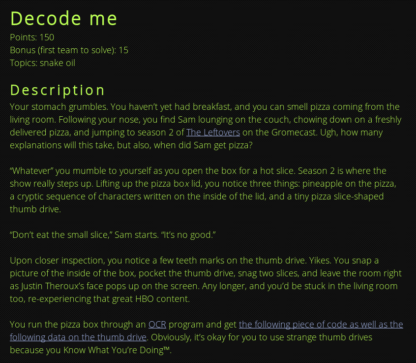
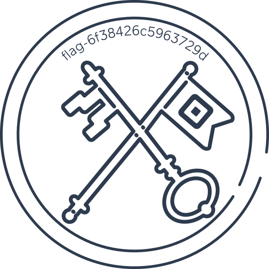

# decodeme



We are provided with a `decodeme.png.enc` that contains a tonne of characters like the set below:

```
EA\6<VG?OKO@ez?c` lCMybc^>=Z8*c5G``HTxu{L6tb1&lG,{EaO*
&Y16%LsUO|`syVD4Eg/cb6>'V*`pTz_,6Q|bGM-Itr6_Ac~yzI\tlTQZ_lHMFyGJb+?	s9ZG/_yqx.ej`5#ArEDX%K-\*6{o<TJeVj
itNXijH#Qr`	{t
XXq5MONLI)~Wv CGC	_d
6dsX,>pDcZ66$ELTeF[M-dLbV[l\{V
XTLjHdb
O)WV{%a._`TUXoZ.s~gbsG}yOjsOcR
liE[ODoZ?JesMo
a,/rsLDrNXEFWK:B`/ZRL@JaAX-ziV
_$<FeNQ^zrIi@r[a8,coK
g&O/ziL/{i	co/-|ccdWi,RvvR~iO,Ng`cGl|ZMbiE[E_IDbRZRVjliOtUy[,(Kr!Lcd8TCsvW}TjA#{N	Lz_T
VVM"~{.|dvXF}0GZes	ey\UE^RWR*.YA\W
`_L)sGbX
L-l{01AT|)Rz'`.	5rE\-TrU+	w Az,gZ{b& >lh/5lWjZ"_06EbsWN,d
 #:Mcg[c(zXZ[Wr,r<5r	a
FKt<srBH?|ezU:~[sw`_rI_c4	byB#epypNiMbWO
```

Alongside this is a file called `encoder.pyc`. This file is the compiled modules for the Python interpreter. This can be trivially reversed to produce perfect python code. This was achieved using [uncompyle2](https://github.com/Mysterie/uncompyle2) and provided us with the file `encoder.py`.

`encoder.py` contains the code that 'encrypted' the `decodeme.png`. We therefore need to find a way to reverse the encryption on the file.

## `encoder.py`

The decompiled code is below:

```python
import base64, string, sys
from random import shuffle

def encode(f, inp):
    s = string.printable
    init = lambda : (list(s), [])
    bag, buf = init()

    for x in inp:
        if x not in s:
            continue
        while True:
            r = bag[0]
            bag.remove(r)
            diff = (ord(x) - ord(r) + len(s)) % len(s)
            if diff == 0 or len(bag) == 0:
                shuffle(buf)
                f.write(str.encode(('').join(buf)))
                f.write(b'\x00')
                bag, buf = init()
                shuffle(bag)
            else:
                break

        buf.extend(r * (diff - 1))
        f.write(str.encode(r))

    shuffle(buf)
    f.write(str.encode(('').join(buf)))

if __name__ == '__main__':

    fileName = "desc.txt"

    with open(fileName, 'rb') as (r):
        w = open(fileName + '.enc', 'wb')
        b64 = base64.b64encode(r.read()).decode("utf-8")
        encode(w, b64)
```

The code when encoding loaded in the `.png` file and encoded it as `base64`. The encoding algorithm was then performed on this `base64` string.

The first thing that stood out to me was the use of the `random.shuffle()` function. This takes a list a shuffles its order. This is an interesting area as you would assume randomness makes it infeasible to reverse. We'll come back to this later.

Lets take a look at the steps of the algorithm:

It begins by created a `bag` and `buf`:

```python
s = string.printable
init = lambda : (list(s), [])
bag, buf = init()
```

`string.printable` == `0123456789abcdefghijklmnopqrstuvwxyzABCDEFGHIJKLMNOPQRSTUVWXYZ!"#$%&\'()*+,-./:;<=>?@[\\]^_``{|}~ \t\n\r\x0b\x0c`

The `bag` contains the list of printable strings and the buffer is an empty list.

The program will then loop around for each character in the input:

```python
for x in inp:
    if x not in s:
        continue
    while True:
        r = bag[0]
        bag.remove(r)
        diff = (ord(x) - ord(r) + len(s)) % len(s)
```

And will calculate the `diff` value. The value of `r` is then removed from the bag.

The code will then check if the `diff==0` or the `bag` is empty.

If either are `true` the code will print out the current state of `buf` add a `\x00`, init the `bag` and `buf` and finish with a shuffle of the `bag`.

This is shown by the code below:
```python
shuffle(buf)
f.write(str.encode(('').join(buf)))
f.write(b'\x00')
bag, buf = init()
shuffle(bag)
```

If both are `false` the code will add into the `buf` `r` multiplied by the `diff - 1` and will print the value of `r`.

This is also shown by the code:

```python
buf.extend(r * (diff - 1))
f.write(str.encode(r))
```

## Decodings


### Step 1 - Gathering values
Now, working our way backwards we need to split each section by the null characters.

This should give us each 'block'. A block should be structured like so:

```
[     Values of R      ][XXXXXXXXXXXXX
XXXXXXXXXXXXXXXXXXXXXXXXXXXXXXXXXXXXXX
XXXXXXXXXXXXXXXXXXXXXXXXXXXXXXXXXXXXXX
XXXXXXXXXXXXXXXXXXXXXXXXXXXXXXXXXXXXXX
XXXXXXXXXXXXXXXXXXXXXXXXXXXXXXXXXXXXXX
XXXXXXXXXXXXXXXXXXXXXXXXXXXXXXXXXXXXXX
XXXXXXXXXXXXXXXXXXXXXXXXXXXXXXXXXXXXX]
```

Where `X` is the values of the shuffles buffer. Now, because the data is composed of an alphabet samples from the values of `r` scanning up until we find a duplicated character should give us the values of `r` used in this block!

This can then be used to look around and count the number of occurrence of each character. This value gives us the sum of `diff - 1`.

This functionality can be seen in this code that processes each block:

```python
# Find output for r
seen = []
r_output = ""

for s in section:

    if s in seen:
        break
    else:
        seen.append(s)
        r_output += s

# Grabs the remaining part of the section
data_output = section[len(r_output):]

# Counts the number of character occurance
char_count = {}
for u in set(list(data_output)):
    char_count.update({u : data_output.count(u)})
```

The order for the `r` string is only order that is useful. Therefore, the shuffling of the `buf` values does not stop us from reversing the encoding.

# Step 2 - Recover original text

We now need to use the values we've found to recover the char value of `x`. However, when `diff` is calculated the mod of `s` is taken, this means there will be realistically two potential values for each value for `diff`.

For example if the value of `r` is `48`, with a `diff` value of  this provides us with a value of `57`. We can calculate the value of `x` as `5` mod 100 (value of `s`).

The code is below:
```python
x = (diff + ord(r)) % 100
```

This means we have two potential values for x. `\x05` or `i` (`x + 100`). By checking these against the character set for a valid `base64` value we can determine the valid potential characters.

The final situation we need to check for is the satiation when there is a character in the `r` string that does not exist in the data section. This will occur when the `diff` is equal to one, this is due to the line:

```python
buf.extend(r * (diff - 1))
```

This will make `diff` is equal to zero, and will result in the character `r` not being added to list.

In summary here is the code that performs this functionality:

```python
for r in r_output:

    if r not in char_count:
        diff = 0 + 1
    else:
        diff = char_count[r] + 1

    x = (diff + ord(r)) % 100

    if chr(x) not in BASE64_CHARS:
        recovered_string += chr(x + 100)
    else:
        recovered_string += chr(x)
```

Putting all these aspects together in a script called `decoder.py`.

Running the script provides us with the image and therefore the flag:



```
FLAG: flag-6f38426c5963729d
```