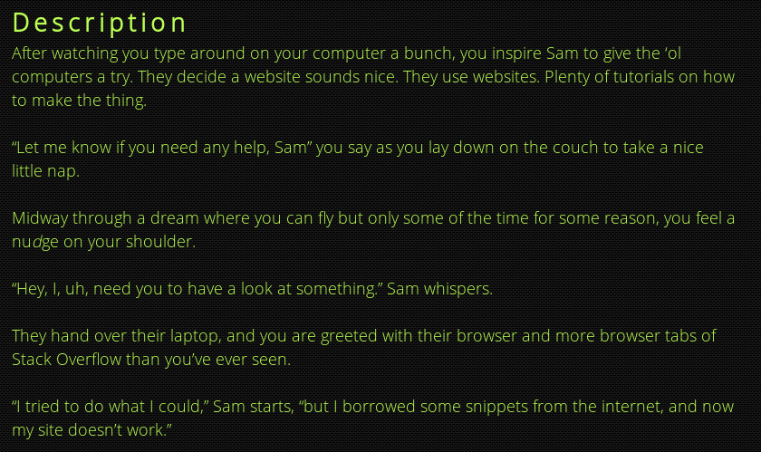
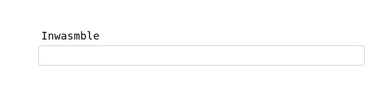
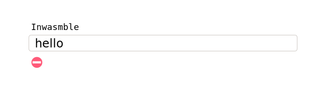
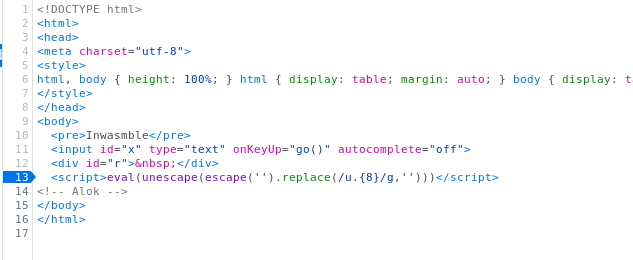
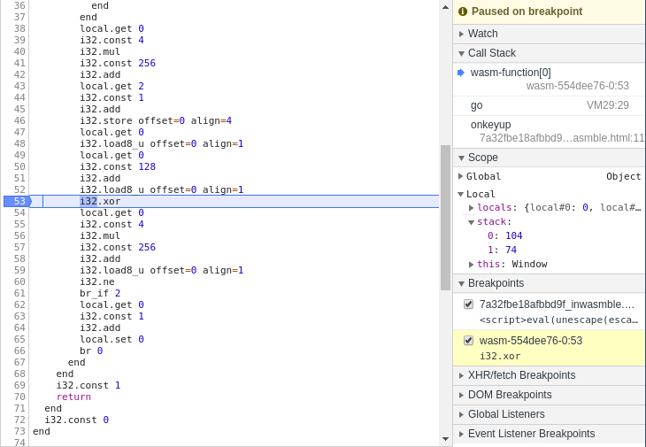
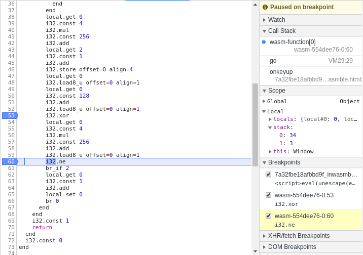
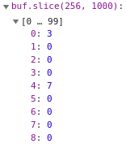
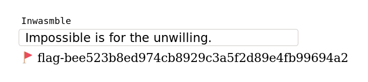

# inwasmble



We're initially provided with a simple web [page](https://2019.squarectf.com/static/files/7a32fbe18afbbd9f_inwasmble.html).



We can provide input:



Putting a break point in the Firefox console lets us walkthrough the operation of the box.



Inspection into the source code of the web page gives us this `javascript`:

```javascript
var code = new Uint8Array([
    0x00, 0x61, 0x73, 0x6d, 0x01, 0x00, 0x00, 0x00, 0x01, 0x05, 0x01, 0x60,
    0x00, 0x01, 0x7f, 0x03, 0x02, 0x01, 0x00, 0x05, 0x03, 0x01, 0x00, 0x01,
    0x07, 0x15, 0x02, 0x06, 0x6d, 0x65, 0x6d, 0x6f, 0x72, 0x79, 0x02, 0x00,
    0x08, 0x76, 0x61, 0x6c, 0x69, 0x64, 0x61, 0x74, 0x65, 0x00, 0x00, 0x0a,
    0x87, 0x01, 0x01, 0x84, 0x01, 0x01, 0x04, 0x7f, 0x41, 0x00, 0x21, 0x00,
    0x02, 0x40, 0x02, 0x40, 0x03, 0x40, 0x20, 0x00, 0x41, 0x20, 0x46, 0x0d,
    0x01, 0x41, 0x02, 0x21, 0x02, 0x41, 0x00, 0x21, 0x01, 0x02, 0x40, 0x03,
    0x40, 0x20, 0x00, 0x20, 0x01, 0x46, 0x0d, 0x01, 0x20, 0x01, 0x41, 0x04,
    0x6c, 0x41, 0x80, 0x02, 0x6a, 0x28, 0x02, 0x00, 0x20, 0x02, 0x6c, 0x21,
    0x02, 0x20, 0x01, 0x41, 0x01, 0x6a, 0x21, 0x01, 0x0c, 0x00, 0x0b, 0x0b,
    0x20, 0x00, 0x41, 0x04, 0x6c, 0x41, 0x80, 0x02, 0x6a, 0x20, 0x02, 0x41,
    0x01, 0x6a, 0x36, 0x02, 0x00, 0x20, 0x00, 0x2d, 0x00, 0x00, 0x20, 0x00,
    0x41, 0x80, 0x01, 0x6a, 0x2d, 0x00, 0x00, 0x73, 0x20, 0x00, 0x41, 0x04,
    0x6c, 0x41, 0x80, 0x02, 0x6a, 0x2d, 0x00, 0x00, 0x47, 0x0d, 0x02, 0x20,
    0x00, 0x41, 0x01, 0x6a, 0x21, 0x00, 0x0c, 0x00, 0x0b, 0x0b, 0x41, 0x01,
    0x0f, 0x0b, 0x41, 0x00, 0x0b, 0x0b, 0x27, 0x01, 0x00, 0x41, 0x80, 0x01,
    0x0b, 0x20, 0x4a, 0x6a, 0x5b, 0x60, 0xa0, 0x64, 0x92, 0x7d, 0xcf, 0x42,
    0xeb, 0x46, 0x00, 0x17, 0xfd, 0x50, 0x31, 0x67, 0x1f, 0x27, 0x76, 0x77,
    0x4e, 0x31, 0x94, 0x0e, 0x67, 0x03, 0xda, 0x19, 0xbc, 0x51
  ]);
  
  var wa = new WebAssembly.Instance(new WebAssembly.Module(code));
  var buf = new Uint8Array(wa.exports.memory.buffer);
  
  async function go() {
    sizes = [...[...Array(4)].keys()].map(x=>x*128);
    buf.set(x.value.substr(sizes[0], sizes[1]).padEnd(sizes[1]).split('').map(x=>x.charCodeAt('')));
    if (wa.exports.validate()) {
      hash = await window.crypto.subtle.digest("SHA-1", buf.slice(sizes[2], sizes[3]));
      r.innerText = "\uD83D\uDEA9 flag-" + [... new Uint8Array(hash)].map(x => x.toString(16)).join('');
    } else {
      r.innerHTML = x.value == "" ? "&nbsp;" : "\u26D4";
    }
}
```

As it can be seen we will have to reverse some `WebAssembly`!

`WebAssembly` is effectively a portable binary code format that can be used to imbed assembly code into websites.

Stepping further into the code gives us this `WebAssembly` code:

```wat
(module
  (type $type0 (func (result i32)))
  (memory (;0;) 1)
  (export "memory" (memory 0))
  (export "validate" (func $func0))
  (func $func0 (result i32)
    (local $var0 i32) (local $var1 i32) (local $var2 i32) (local $var3 i32)
    i32.const 0
    set_local $var0
    block $label3
      block $label0
        loop $label4
          get_local $var0
          i32.const 32
          i32.eq
          br_if $label0
          i32.const 2
          set_local $var2
          i32.const 0
          set_local $var1
          block $label1
            loop $label2
              get_local $var0
              get_local $var1
              i32.eq
              br_if $label1
              get_local $var1
              i32.const 4
              i32.mul
              i32.const 256
              i32.add
              i32.load
              get_local $var2
              i32.mul
              set_local $var2
              get_local $var1
              i32.const 1
              i32.add
              set_local $var1
              br $label2
            end $label2
          end $label1
          get_local $var0
          i32.const 4
          i32.mul
          i32.const 256
          i32.add
          get_local $var2
          i32.const 1
          i32.add
          i32.store
          get_local $var0
          i32.load8_u
          get_local $var0
          i32.const 128
          i32.add
          i32.load8_u
          i32.xor
          get_local $var0
          i32.const 4
          i32.mul
          i32.const 256
          i32.add
          i32.load8_u
          i32.ne
          br_if $label3
          get_local $var0
          i32.const 1
          i32.add
          set_local $var0
          br $label4
        end $label4
      end $label0
      i32.const 1
      return
    end $label3
    i32.const 0
  )
  (data (i32.const 128)
    "Jj[`\a0d\92}\cfB\ebF\00\17\fdP1g\1f'vwN1\94\0eg\03\da\19\bcQ"
  )
)
```

After a long time stepping through the code it can be seen that the code is xoring the entered characters with the 
data string `"Jj[``\a0d\92}\cfB\ebF\00\17\fdP1g\1f'vwN1\94\0eg\03\da\19\bcQ"`.

From the example below the stack contains the character entered 104 (`h`) and the xor value 74 (`J` the first value of the Xor string)



Jumping to next check `i32.ne` that checks for equality:



Looking at the stack gives the output of the pervious XOR operation and the expected value `3`.

The expected value of the password can be calculated using the xor of the character in the xor string and the expected:

```
char_of_pass = XOR_Char ^ Expected_Value
```

In this example this gives: 73 (`I`).

After further stepping through I can see that every 4 bytes from the index 256 in the scripts memory has the expected character. 

The buf slice from 256 can be seen below:



It fills in for every correct character.

After manual extracting these values from the `buf` and adding them to a very simple script:

```python
target = [
             3,   7,  43,  15, 211,  23, 251,  31, 163,  39, 203, 
            47, 115,  55, 155,  63,  67,  71, 107,  79,  19,  87, 
            59,  95, 227, 103,  11, 111, 179, 119, 219, 127
        ]

xor_string = b"Jj[`\xa0d\x92}\xcfB\xebF\x00\x17\xfdP1g\x1f'vwN1\x94\x0eg\x03\xda\x19\xbcQ"

for i, x in enumerate(xor_string):
    print(chr(x ^ target[i]), end="")

print()
```

The correct input, therefore, is:

```
Impossible is for the unwilling.
```

Entering this gives us the flag:



```
FLAG: flag-bee523b8ed974cb8929c3a5f2d89e4fb99694a2
```