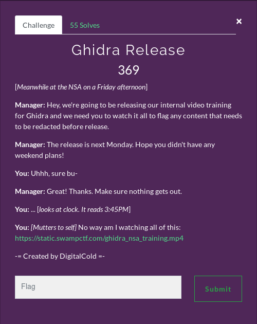
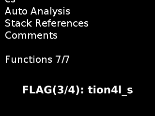
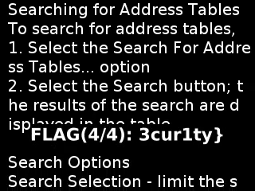

# Ghidra Release



https://static.swampctf.com/ghidra_nsa_training.mp4

The video file can be found at the url above, its too big for an upload to Github.

The video is over 15hours long, therefore, a manual review to find the flag(s) will be infeasible.

The chosen method was the use of ```OpenCV``` to obtain frames from the video and ```pytesseract``` as the OCR library for text recognition on the video frames to look for the flag.

### Method

Initially I ran it through while skipping a large 2000 frames (80 seconds) for each OCR run. This luckily picked up one of the flags.

The frame detected is below:



This showed the format of the challenge. The flags will appear at the bottom section of the frame. Therefore, an efficiency improvement was cropping the obtained frame.

The cropped result is below:


The number of frame skipped was reduced and the algorithm was reduced to around 25 frames (1 second) jumps. This increased the execution time but allowed thorough analysis of the video's frames. 

The overall execution time was ~2hr. I don't think that is the best that could be done and would like to see more efficient solutions.

### Code

```python
import cv2 as cv2
import pytesseract
import sys  

def crop(im, x, y):
    w = 350
    h = 75
    return im[y:y+h, x:x+w]

# How many frames are skipped in one go
FRAME_SKIP = 25

# Built in openCV variables
CV_CAP_PROP_POS_FRAMES = 1
CV_CAP_PROP_FRAME_COUNT = 7

success = True
video = cv2.VideoCapture("./training.mp4")
total_frames = video.get(CV_CAP_PROP_FRAME_COUNT)

frame_val = 0

while success:

    success, frame = video.read()

    # Skips the video forward
    frame_val += FRAME_SKIP
    video.set(CV_CAP_PROP_POS_FRAMES, frame_val)
    
    # Crops the bottom of the frame, this is where the flag will appear
    crop_img = crop(frame, x=0, y=150)

    # OCR detection
    text = pytesseract.image_to_string(image=crop_img, lang="eng")

    if "FLAG" in text:
        sys.stdout.write("TEXT: ")
        sys.stdout.write(text)
        sys.stdout.write("\n")
        cv2.imwrite(f"FLAG_{frame_val}.png", crop_img)

    sys.stderr.write(f"PROGRESS: {round(frame_val / total_frames * 100, 2)}%\r")
```

The code was run and detected all sections of the flag and saved them to file




These combined provided the flag.

```
FLAG: flag{l34kfr33_n4tion4l_s3cur1ty}
```