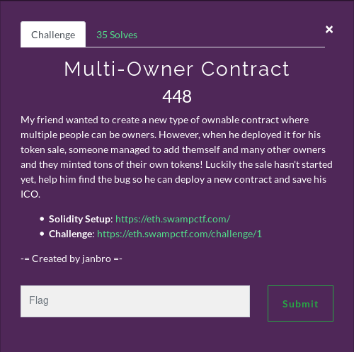

# Multi-Owner Contract



### Links
Solidity Setup: https://eth.swampctf.com/

Challenge: https://eth.swampctf.com/challenge/1

### Solution
Smart contract challenges in a CTF is a first for me, so this was a very interesting process.

We were provided with a smart contract that we had to deploy on the Ethereum Ropsten Test Network.

Below is the provided contract:

```javascript

pragma solidity ^0.4.24;

contract Ownable {

    event OwnerAdded(address);
    event OwnerRemoved(address);

    address public implementation;
    mapping (address => bool) public owners;

    modifier onlyOwner() {
        require(owners[msg.sender], "Must be an owner to call this function");
        _;
    }

    /** Only called when contract is instantiated
     */
    function contructor() public payable {
        require(msg.value == 0.5 ether, "Must send 0.5 Ether");
        owners[msg.sender] = true;
    }

    /** Add an owner to the owners list
     *  Only allow owners to add other owners
     */
    function addOwner(address _owner) public onlyOwner { 
        owners[_owner] = true;
        emit OwnerAdded(_owner);
    }

    /** Remove another owner
     *  Only allow owners to remove other owners
     */
    function removeOwner(address _owner) public onlyOwner { 
        owners[_owner] = false;
        emit OwnerRemoved(_owner);
    }

    /** Remove all owners mapping and relinquish control of contract
     */
    function renounceOwnership() public {
        assembly {
            sstore(owners_offset, 0x0)
        }
    }
    
    /** CTF helper function
     *  Used to clean up contract and return funds
     */
    function killContract() public onlyOwner {
        selfdestruct(msg.sender);
    }

    /** CTF helper function
     *  Used to check if challenge is complete
     */
    function isComplete() public view returns(bool) {
        return owners[msg.sender];
    }

}
```
The flag will be provided when we make ourselves the owner of the contract. This is show in this function:

```javascript
function isComplete() public view returns(bool) {
    return owners[msg.sender];
}
```

Initially I thought calling the ```renounceOwnership()``` method was the way forward. I assumed this would overwrite all the owners and allow me to own the contract. However, I couldn't get it working and decided to move on.


Then I noticed the spelling mistake in the name of the 'contructor()' method, this is instead of 'constructor()'. This means this method can be called again after the creation of the contract.

```javascript
function contructor() public payable {
    require(msg.value == 0.5 ether, "Must send 0.5 Ether");
    owners[msg.sender] = true;
}
```
The method required 0.5 ETH to run, this required the use of another account due to the  only providing 1 ETH per 24 hours.

By calling the wrongly name constructor method again I was assigned owner. I then added the original account as a owner to complete the challenge.

After the website infrastructure called the main contract to verify completion I was provided with a flag.

```
FLAG: flag{3v3ryb0dy5_hum4n_r34d_c10s31y}
```