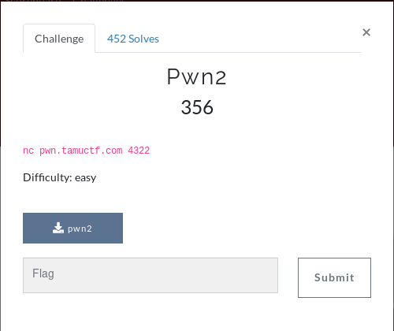

# pwn2



Starting like any other challenge we'll take a look at ```file``` and ```checksec```.

```diff
[*] './pwn2'
    Arch:     i386-32-little
-    RELRO:    Partial RELRO
-    Stack:    No canary found
+    NX:       NX enabled
+    PIE:      PIE enabled
```

```
pwn2: ELF 32-bit LSB pie executable, Intel 80386, version 1 (SYSV), dynamically linked, interpreter /lib/ld-linux.so.2, for GNU/Linux 3.2.0, BuildID[sha1]=c3936da4c051f1ca58585ee8b243bc9c4a37e437, not stripped
```

So we can tell from these outputs that we cannot run shellcode and the binary isn't stripped.