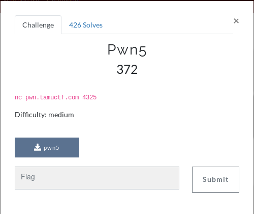

# pwn5



In a similar way to pwn4 we were prompted with:

```
ls as a service (laas)(Copyright pending)
Version 2: Less secret strings and more portable!
Enter the arguments you would like to pass to ls:
```

This had a string restriction on the string but still allowed ```;sh```. This provided us with a shell to once again ```cat flag.txt```.

Once again, this challenge was broken and the solution was far too simple.

```
FLAG: gigem{r37urn_0r13n73d_pr4c71c3}
```